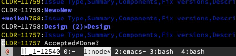

### ICU and CLDR’s Trac to JIRA converter



- note tags `icu-conversion` and `cldr-conversion` respectively for the two projects.

to use:
- node version 8 required. (Seems to be requiring exactly 8 at the moment.)
- `npm i`

- modify `config.json` so that `db.path` points to the sqlite3 trac database dump and `db.attachmentPath` points to the `/ticket/` subdirectory of the trac attachments.  ALso `project.name` sets with PROJECT will be modified.

- create a `local-auth.json` as follows. If you have 2FA (you do, right?) you will need to use an API token instead of your password - https://id.atlassian.com/manage/api-tokens#

```json
{
    "jira": {
        "protocol": "https",
        "host": "blahblah.atlassian.net",
        "username": "you@you.you",
        "password": "hunter42",
        "apiVersion": "2",
        "strictSSL": true
    }
}
```


Notes:

- this is an incremental conversion. you can run it lots of times.

- you might want to turn off email notification for the duration.
    - just saying.

- to just convert 1 ticket, etc. use a SQL query: `node try.js 'where id=13472'`

- run `node try.js` to run the converter on ALL tickets.

- It's possible that if versions/components/priorities were not in sync you will get an error and have to run the tool again.  (priorities need to be added manually. sorry.)

- yes `npm t` will run tests.  Tests. There are tests?!

- postscript: `node fixReporter.js` will try to fix the Reporter field from tracReporter
  (Needs `unknownUsers.csv`  table mapping from trac->jira)

### License

Copyright © 2018-2023 Unicode, Inc. Unicode and the Unicode Logo are registered trademarks of Unicode, Inc. in the United States and other countries.

The project is released under [LICENSE](./LICENSE).

A CLA is required to contribute to this project - please refer to the [CONTRIBUTING.md](https://github.com/unicode-org/.github/blob/main/.github/CONTRIBUTING.md) file (or start a Pull Request) for more information.

